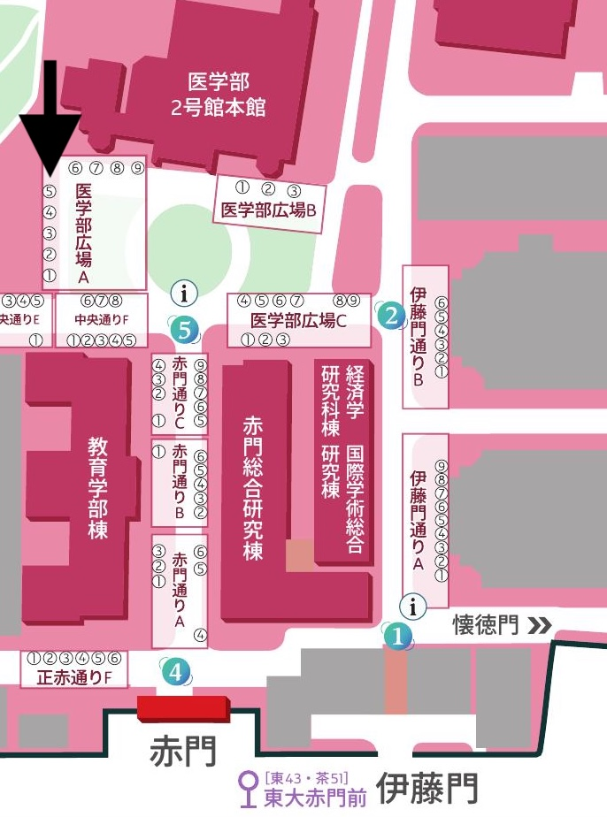

# 五月祭出展計画書

## 1.出展名　飯舘村麦酒大学

## 2.出展団体　東京大学飯舘村ホッププロジェクト

## 3.出展目的

本プロジェクトは、2023年度11月より福島県飯舘村の復興支援の一環として発足しました。耕作放棄地を再利用したホップ栽培を通じて、飯舘村の地域ブランドの確立、関係人口の創出、そして情報発信源としての役割を果たすことに寄与しています。昨年度ホップ栽培に成功し、クラフトビールの販売に漕ぎ着けましたので、この実績をもってクラフトビールと飯舘村の産品を販売することにより、今回の五月祭にて飯舘村の魅力および[本プロジェクトの地域活性化の取り組み](https://drive.google.com/file/d/1Om8E3GLatPO8rKZcP08Sf2zx0P8rqiJ3/view?usp=drive_link) を広く発信します。

## 4.開催日時 5/24(土) 5/25(日)

両日 9:00 - 18:00 開催 [公式リンクはこちら](https://gogatsusai.jp/98/visitor/) 
出展場所 赤門エリア 医学部広場A-5

## 5.販売品目・価格

### 商品リスト

| 品目 | 内容量 | 価格 |
|--------------------|---------------|-------|
| クラフトビール | 200mL | 500円 |
| アサヒビール | 200mL | 300円 |
| 飲み比べセットミニ | 100mL × 2 | 400円 |
| 飲み比べセット | 150mL × 2 | 600円 |
| あられ(しお味) | 1袋 | 300円 |
| あられ(こしょう味) | 1袋 | 300円 |

あられは飯舘村産あぶくまもちを使用した鈴鹿あられです。
**20歳未満へのアルコール提供はいたしません。五月祭実行委員会発行のアルコールパスを持参している方のみの提供となります。**

## 6.営業日程

5/24(土) 5/25(日) 9:00 - 18:00
**両日とも販売予定量を完売次第終了します。ご了承ください**

## 7.販売体制

学生スタッフ5〜6名で交代制
販売・会計・呼び込み・年齢確認の役割分担
酒類提供に関しては責任者を常駐

## 8.備品リスト

| 種類 | 備品名 | 備考 |
| --- | --- | --- |
| 委員会手配 | テント | |
| 委員会手配 | テント装飾セット| 店頭看板用 |
| 委員会手配 | 耐火シート | |
| 委員会手配 | 長机 | 2脚 |
| 委員会手配 | クーラーボックス | アサヒ用 |
| 委員会手配 | 台車 | |
| 委員会手配 | 氷 | 柱氷6貫 |
| 自前用意 | サーバー | レンタル |
| 自前用意 | プラコップ | 4オンス, 7オンス 各1000個 |
| 自前用意 | メニュー表 | |
| 自前用意 | 宣伝用ボード | |
